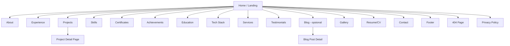
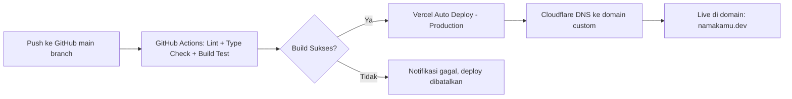
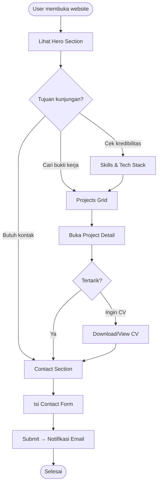
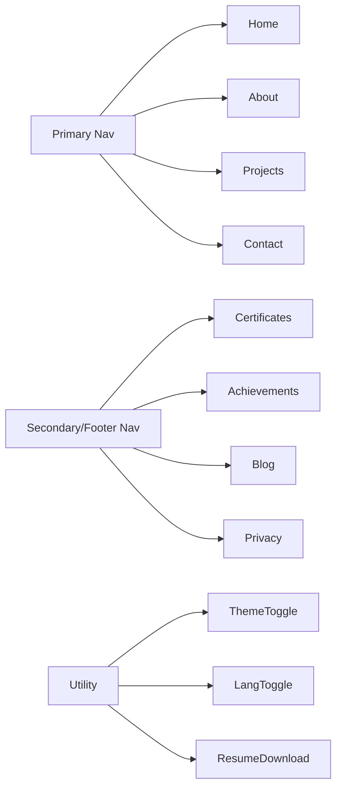
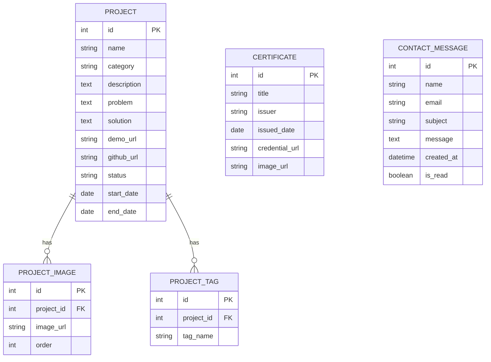

# Product Requirements Document (PRD)
## Personal Portfolio Website — Software Engineer

| | |
|---|---|
| **Dokumen** | PRD Personal Portfolio Website |
| **Versi** | 1.0 |
| **Tanggal** | 11 Juli 2026 |
| **Disusun oleh** | Senior PM & Senior UI/UX Designer (AI-assisted) |
| **Status** | Draft — Ready for Design & Development |
| **Target Rilis MVP** | 4 minggu dari kickoff |

---

## Daftar Isi
1. Product Overview
2. User Persona
3. Sitemap
4. Landing Page
5. About Me
6. Skills
7. Experience
8. Projects
9. Certificates
10. Education
11. Achievements
12. Tech Stack
13. Resume / CV
14. Social Media
15. Contact
16. Footer
17. Fitur Tambahan
18. Admin (Opsional)
19. Tech Recommendation
20. Design System
21. UI Components
22. Responsive Design
23. SEO Strategy
24. Performance Target
25. Animation Guideline
26. Accessibility
27. Future Roadmap
28. Deployment
29. Deliverables

---

## 1. Product Overview

### Tujuan Website
Membangun personal portfolio website yang berfungsi sebagai **personal branding hub** — satu tempat yang merangkum identitas profesional, kemampuan teknis, dan bukti kerja nyata (project) seorang Software Engineer, sehingga siapa pun yang mencari informasi tentang kompetensi pemilik website bisa mendapat gambaran lengkap dalam waktu singkat, tanpa harus membuka banyak platform terpisah (LinkedIn, GitHub, CV PDF, dsb).

### Target User
| User | Kebutuhan Utama |
|---|---|
| Recruiter | Screening cepat, validasi skill vs kebutuhan role |
| HR | Data kontak, ketersediaan, red flag check |
| Tech Lead | Kedalaman teknis, kualitas kode, cara berpikir problem-solving |
| Client (freelance) | Bukti hasil kerja, testimoni, cara menghubungi & harga |
| Founder Startup | Kecocokan budaya, kecepatan eksekusi, versatility |
| Developer lain | Referensi teknis, inspirasi, kolaborasi/OSS |

### Problem yang Diselesaikan
- CV PDF statis tidak cukup menunjukkan proses berpikir & kualitas kerja nyata.
- LinkedIn/GitHub terlalu "mentah" dan tidak bercerita (tidak ada narasi problem → solution → impact).
- Recruiter butuh waktu < 60 detik untuk memutuskan lanjut/tidak — website harus scannable.
- Sulit membedakan diri dari kandidat lain yang skill-nya serupa di atas kertas.

### Value Proposition
> "Satu website yang membuktikan — bukan hanya mengklaim — bahwa saya bisa membangun produk software dari nol sampai deploy, dengan proses kerja yang jelas dan hasil yang terukur."

Diferensiasi: storytelling berbasis studi kasus project (problem–solution–impact), bukan sekadar daftar teknologi.

---

## 2. User Persona

### Persona 1 — Recruiter (Agency/In-house)
- **Goals:** Menemukan kandidat yang cocok secepat mungkin untuk banyak posisi sekaligus.
- **Pain Points:** Waktu sangat terbatas, banyak portfolio generik/template kosong tanpa isi nyata.
- **Kebutuhan:** Ringkasan skill di atas fold, CV bisa didownload cepat, kontak jelas.
- **User Journey:** Landing → scan Hero (role & tech stack) → scroll Skills → cek 1–2 Project → download CV → klik WhatsApp/Email.

### Persona 2 — HR
- **Goals:** Verifikasi data administratif (pendidikan, pengalaman, ketersediaan) sebelum lanjut ke tahap teknis.
- **Pain Points:** Data CV dan portfolio sering tidak konsisten; sulit menghubungi kandidat.
- **Kebutuhan:** Section Education, Experience, dan Contact yang jelas dan up-to-date.
- **User Journey:** Landing → About Me → Experience/Education → Contact form → submit.

### Persona 3 — Client (Freelance)
- **Goals:** Menilai apakah developer ini bisa dipercaya mengerjakan proyek berbayar dengan hasil sesuai ekspektasi.
- **Pain Points:** Takut kena developer "hilang di tengah project", takut kualitas rendah, tidak tahu range harga.
- **Kebutuhan:** Studi kasus project detail (before/after, demo, testimoni), Services section, cara booking konsultasi.
- **User Journey:** Landing → Projects (detail case study) → Testimonials → Services/Contact → jadwalkan meeting.

### Persona 4 — Sesama Developer
- **Goals:** Melihat kualitas kode, arsitektur, dan kemungkinan kolaborasi/OSS.
- **Pain Points:** Portfolio developer lain sering tidak transparan soal tech stack & challenge teknis.
- **Kebutuhan:** GitHub link aktif, penjelasan Challenges & Lessons Learned per project, tech stack detail.
- **User Journey:** Landing → Tech Stack → Projects (baca Challenges/Lessons Learned) → GitHub profile.

---

## 3. Sitemap



> Catatan: Untuk MVP, banyak section (About–Testimonials) sebaiknya berupa **single-page dengan anchor scroll (SPA-like)**, bukan halaman terpisah — kecuali Project Detail, Blog Post Detail, dan Privacy Policy yang memang butuh route sendiri untuk SEO dan deep-linking.

---

## 4. Landing Page

| Elemen | Detail |
|---|---|
| Foto | Foto profil profesional/kasual-profesional, format WebP, dengan efek subtle (gradient border/glow) |
| Nama | Ditampilkan besar, font display |
| Role | Contoh: "Software Engineer · Fullstack Developer" — bisa rotate 2–3 role via typing animation |
| Typing Animation | Efek typewriter untuk role/tagline (Framer Motion/typewriter-effect), respects `prefers-reduced-motion` |
| CTA | 2 tombol: "Lihat Project" (primary) & "Download CV" atau "Hubungi Saya" (secondary) |
| Background | Gradient mesh / subtle particle / grid pattern, tidak boleh mengganggu kontras teks |
| Social Links | Icon row kecil (GitHub, LinkedIn, Email) di dekat Hero |
| Statistics | Counter animasi: jumlah project selesai, tahun pengalaman/belajar, tech stack dikuasai |
| Available for Work Badge | Badge kecil dengan dot animasi (hijau = available), status bisa di-toggle dari CMS/config |
| Scroll Indicator | Ikon mouse/chevron animasi bounce di bawah Hero, klik untuk scroll ke About |

---

## 5. About Me

- **Foto:** Foto tambahan (lebih personal/santai) berbeda dari Hero.
- **Perjalanan Karir/Story:** Narasi singkat: latar belakang pendidikan (vocational diploma → informatics/RPL), bagaimana mulai coding, project besar yang membentuk arah karier.
- **Visi:** 1–2 kalimat arah jangka panjang (mis. menjadi fullstack/software engineer yang membangun produk berdampak).
- **Misi:** 3 poin actionable (terus belajar, membangun project nyata, berkontribusi ke komunitas/OSS).
- **Fun Facts:** 3–4 poin ringan (mis. "Sedang membangun game horor Roblox di waktu luang", "Migrasi total ke Linux dan belum menyesal").
- **Hobi:** Gaming, workout, side-project development.
- **Bahasa:** Bahasa Indonesia (native), English (professional working proficiency).
- **Lokasi:** Kota domisili + status remote-friendly.

---

## 6. Skills

Ditampilkan sebagai grid card per kategori, masing-masing skill punya progress bar/level (Beginner–Intermediate–Advanced–Expert) dan icon.

| Kategori | Contoh Isi |
|---|---|
| Frontend | React, JavaScript, Tailwind CSS/Bootstrap, Blade (Laravel templating) |
| Backend | Node.js, Express, PHP, Laravel |
| Mobile | (opsional — isi jika ada, atau sembunyikan section) |
| Database | MySQL |
| Cloud | (opsional — isi sesuai pengalaman deploy, mis. Vercel/shared hosting) |
| DevOps | Git, GitHub Actions (dasar), CI/CD konsep |
| Tools | VS Code, Postman, Fedora Linux/KDE Plasma, Cisco Packet Tracer |
| Design | Figma (dasar), prinsip UI/UX untuk developer |
| Soft Skills | Problem Solving, Project Leadership, Team Collaboration, Communication |

> Personalisasi: karena stack utama kamu adalah Node.js/Express, React, Laravel/PHP, dan MySQL, tampilkan skill ini sebagai "Advanced" dan skill lain (cloud, mobile) sebagai "Learning" agar jujur dan tetap kredibel di mata Tech Lead.

---

## 7. Experience

Timeline vertikal (alternating kiri-kanan di desktop, single column di mobile). Karena posisi sebagai fresh graduate, "Experience" bisa mencakup magang, freelance, dan project leadership (bukan hanya kerja formal).

| Field | Keterangan |
|---|---|
| Nama Perusahaan/Klien | Contoh: Internship Network Technician, atau nama klien freelance |
| Posisi | Contoh: Network Technician Intern / Project Lead (Freelance/Side Project) |
| Durasi | Bulan–Tahun s/d Bulan–Tahun |
| Deskripsi | 2–3 kalimat tanggung jawab utama |
| Tech Stack | Badge kecil tools yang dipakai |
| Achievement | Bullet dengan angka/hasil terukur jika ada (mis. jumlah device dikonfigurasi, uptime, dsb.) |
| Logo Perusahaan | Ikon/logo perusahaan (fallback inisial jika tidak ada) |

---

## 8. Projects

Section paling penting — ditampilkan sebagai grid card dengan filter kategori (Web App, Dashboard, Marketplace). Klik card → Project Detail Page. Urutan project disusun agar selaras dengan positioning CV: **"Aspiring Front-End Web Developer | JavaScript & React Enthusiast."**

**Skema data per project:**

| Field | Keterangan |
|---|---|
| Thumbnail | Screenshot utama/mockup, 16:9 |
| Nama | Nama project |
| Kategori | Web App / Dashboard / Marketplace |
| Deskripsi Singkat | 1–2 kalimat untuk card |
| Role Saya | Solo Developer / Fullstack Developer / Admin Dashboard Developer |
| Tech Stack | Badge list |
| Problem | Masalah nyata yang melatarbelakangi project |
| Solution | Bagaimana project menyelesaikannya |
| Features | Bullet list fitur utama |
| Challenges | Kesulitan teknis yang dihadapi |
| Lessons Learned | Insight yang didapat |
| Timeline | Durasi pengerjaan |
| Status | Completed / In Progress / Maintained |
| Demo | Link live demo (jika ada) |
| Github | Link repo (public/private note) |
| Screenshots/Gallery | 3–6 gambar |
| Video Demo | Embed YouTube/Loom (opsional) |

**Case study lengkap — 4 project, disusun berdasarkan data riwayat kerja di CV (urutan = prioritas tampil di grid):**

### 1. NusantaraLens *(Featured Project)*
| Field | Isi |
|---|---|
| Kategori | Web App (AI-Integrated) |
| Role Saya | Fullstack Web Developer (Project-Based) |
| Tech Stack | React, Vite, JavaScript |
| Timeline | Feb 2026 – Sekarang |
| Status | In Progress |
| Deskripsi Singkat | Aplikasi web yang mengintegrasikan fitur AI Assistant dengan fokus pada UI/UX interaktif. |
| Problem | Dibutuhkan antarmuka AI Assistant yang interaktif dan mudah diakses dalam aplikasi web, tanpa mengorbankan performa dan pengalaman pengguna. |
| Solution | Merancang & mengimplementasikan komponen front-end utama (Navbar, Hero, AI Assistant) menggunakan React dengan Vite sebagai build tool, termasuk state management untuk interaksi real-time dengan AI Assistant. |
| Features | Navbar & Hero kustom, AI Assistant chat interface, local dev environment terkelola, integrasi ke backend tim. |
| Challenges | Menyelaraskan komponen front-end dengan API backend yang dikembangkan tim lain secara paralel; mengelola state untuk respons AI real-time tanpa mengorbankan performa. |
| Lessons Learned | Pentingnya kontrak API yang jelas saat kerja frontend–backend paralel; state management untuk aplikasi AI-driven. |

### 2. UniQuest — Admin Dashboard (Kompetisi Inovasi Kampus PIKMI)
| Field | Isi |
|---|---|
| Kategori | Dashboard |
| Role Saya | Admin Dashboard Developer |
| Tech Stack | React JS, Tailwind CSS |
| Timeline | Nov 2024 |
| Status | Completed |
| Deskripsi Singkat | Platform untuk absensi, riwayat aktivitas, penilaian perilaku, dan sistem reward mahasiswa. |
| Problem | Kampus membutuhkan satu sistem terpadu untuk memantau kehadiran, aktivitas, dan perilaku mahasiswa yang sebelumnya tersebar di banyak proses manual. |
| Solution | Membangun dashboard admin responsif yang mengonsolidasikan data absensi, riwayat aktivitas, penilaian perilaku, dan reward mahasiswa dalam satu antarmuka. |
| Features | Modul absensi, riwayat aktivitas, sistem penilaian perilaku, sistem reward. |
| Challenges | Timeline kompetisi yang ketat serta koordinasi pembagian kerja front-end/back-end dalam tim. |
| Lessons Learned | Rapid prototyping di bawah tekanan waktu; desain UX dashboard yang berorientasi pada pengguna admin. |

### 3. Jasaku — Local Freelance Marketplace
| Field | Isi |
|---|---|
| Kategori | Marketplace |
| Role Saya | Fullstack Developer (Tim Proyek Akhir) |
| Tech Stack | Laravel, MySQL, Blade, Tailwind CSS/Bootstrap |
| Status | Completed (Proyek Akhir Kuliah) |
| Deskripsi Singkat | Platform marketplace freelance lokal yang mempertemukan penyedia jasa dan klien dalam satu sistem terpadu. |
| Problem | Sulitnya menemukan penyedia jasa freelance lokal yang terpercaya tanpa platform yang jelas. |
| Solution | Membangun marketplace end-to-end dengan metodologi Waterfall, mencakup autentikasi pengguna, listing jasa, dan manajemen pesanan. |
| Features | Autentikasi user, listing & pencarian jasa, manajemen pesanan, sistem review/rating. |
| Challenges | Menyusun dokumentasi SDLC lengkap (PRD, desain UI/UX) sesuai standar akademik sambil menjaga kualitas kode produksi. |
| Lessons Learned | Praktik dokumentasi requirement formal serta kolaborasi tim dalam metodologi terstruktur. |

### 4. Kenangku — Personalized Digital Greeting Service
| Field | Isi |
|---|---|
| Kategori | Web App |
| Role Saya | Solo Developer |
| Tech Stack | HTML, CSS, JavaScript (vanilla, tanpa framework) |
| Status | Completed / Maintained |
| Deskripsi Singkat | Layanan web untuk membuat halaman ucapan ulang tahun yang personal dan berkesan. |
| Problem | Minimnya opsi ucapan digital yang personal dibanding template generik yang umum beredar. |
| Solution | Membangun layanan web ringan tanpa dependency framework, dengan model pengiriman dua tingkat (tier). |
| Features | Halaman ucapan kustom, model pengiriman dua tier. |
| Challenges | Menjaga struktur kode tetap rapi dan maintainable meski dibangun tanpa framework. |
| Lessons Learned | Penguasaan fundamental DOM manipulation & vanilla JS. |

> **Catatan strategi:** NusantaraLens dan UniQuest ditempatkan sebagai 2 project unggulan pertama karena paling relevan & terbaru untuk role Front-End/Fullstack Web Developer. Project non-web (game) sebelumnya dihilangkan dari portfolio utama agar branding tetap fokus dan konsisten dengan CV — jika suatu saat ingin ditampilkan, sebaiknya di section terpisah (mis. "Creative Side Projects") agar tidak mengaburkan positioning utama sebagai web developer.

---

## 9. Certificates

Grid card (3 kolom desktop, 1 kolom mobile).

| Field | Keterangan |
|---|---|
| Logo | Logo issuer (mis. Dicoding, DBS Foundation) |
| Nama Sertifikat | Judul lengkap |
| Issuer | Dicoding / DBS Foundation / dsb. |
| Tanggal | Bulan Tahun terbit |
| Credential ID | Kode verifikasi |
| Preview | Thumbnail sertifikat |
| Download | Tombol download PDF/PNG |

---

## 10. Education

Timeline pendidikan, format serupa Experience:

- **Universitas Nusa Mandiri** — Informatika (fokus RPL/Software Engineering) — status & tahun.
- **Pendidikan vokasi** (SMK/diploma sebelumnya) — jurusan & tahun.

---

## 11. Achievements

Grid/list dengan icon kategori:

- 🏆 Hackathon
- 🥇 Competition
- 🎖️ Awards
- 📄 Publication
- 🌐 Open Source Contribution

> Jika saat ini belum banyak achievement formal, section ini bisa disederhanakan menjadi "Highlights" yang mencakup pencapaian project (mis. "Memimpin tim 3 orang menyelesaikan game Roblox dari PRD hingga playable build").

---

## 12. Tech Stack

Visual icon grid, dikelompokkan per kategori (pakai [Devicon](https://devicon.dev) atau [Simple Icons](https://simpleicons.org)):

| Kategori | Icon Stack |
|---|---|
| Languages | JavaScript, PHP |
| Frontend | React, Tailwind CSS, Bootstrap |
| Backend | Node.js, Express, Laravel |
| Database | MySQL |
| Networking | Cisco Packet Tracer |
| OS & Tools | Fedora Linux, KDE Plasma, VS Code, Git, GitHub |
| AI-Assisted Dev | Claude Code, Gemini CLI |

---

## 13. Resume / CV

| Elemen | Detail |
|---|---|
| Preview CV | Embed viewer PDF langsung di halaman (react-pdf/iframe) |
| Download CV | Tombol download PDF, trigger event analytics |
| View Online | Buka di tab baru (Google Drive/hosted link) |
| Update Terakhir | Tanggal auto-update dari metadata file |
| Ukuran File | Ditampilkan otomatis (mis. "245 KB") |

---

## 14. Social Media

Icon row yang clickable, buka di tab baru, dengan tooltip nama platform:

LinkedIn · GitHub · GitLab · Instagram · X (Twitter) · Threads · Facebook · Discord · Telegram · Email · WhatsApp · Medium · Dev.to · YouTube · Behance · Dribbble · LeetCode · HackerRank · Codeforces · Stack Overflow

> Rekomendasi: tampilkan hanya platform yang **aktif digunakan** (GitHub, LinkedIn, Email, WhatsApp wajib; sisanya opsional) agar tidak terlihat "penuh tapi kosong" di mata recruiter.

---

## 15. Contact

**Contact Form fields:**
- Nama
- Email
- Subject
- Message
- Captcha (Cloudflare Turnstile — lebih ringan & privacy-friendly dibanding reCAPTCHA)

**Info tambahan:**
- Lokasi (kota, status remote-friendly)
- Email langsung (mailto: link)
- WhatsApp (wa.me link dengan pre-filled message)
- Kalender Meeting (opsional — Calendly/Cal.com embed untuk client freelance)
- CTA "Hire Me" / "Let's Work Together" di atas form

---

## 16. Footer

- Quick Links (anchor ke semua section utama)
- Social Media icons (ringkas)
- Copyright — "© 2026 [Nama]. All rights reserved."
- Back to Top button (floating, muncul setelah scroll > 300px)

---

## 17. Fitur Tambahan

| Fitur | Prioritas |
|---|---|
| Dark Mode / Light Mode | Must Have |
| Multi Language (ID/EN) | Should Have |
| SEO Optimization | Must Have |
| PWA | Could Have |
| Fast Loading | Must Have |
| Accessibility | Must Have |
| Responsive | Must Have |
| Smooth Animation | Must Have |
| Loading Skeleton | Should Have |
| Scroll Animation | Should Have |
| Page Transition | Could Have |
| Command Palette (Cmd+K) | Could Have |
| Search | Could Have |
| Visitor Counter | Could Have |
| Analytics (Vercel Analytics/Plausible) | Should Have |
| Reading Time (untuk blog) | Should Have |
| Scroll Progress Bar | Could Have |
| Cursor Effect | Won't Have (MVP) |
| Music Toggle | Won't Have (MVP) |
| Custom 404 | Must Have |
| Custom Loader | Should Have |

---

## 18. Admin (Opsional — CMS)

| Opsi | Kelebihan | Kekurangan | Rekomendasi |
|---|---|---|---|
| Markdown/MDX (file-based) | Gratis, versioned via Git, cocok untuk dev solo, tidak butuh backend tambahan | Update konten harus lewat commit/PR (tidak ramah non-teknis) | ✅ **Direkomendasikan untuk MVP** — paling selaras dengan skill Node.js/React yang sudah dikuasai |
| Notion API | Sangat mudah update konten dari UI Notion (kamu sudah pakai Notion untuk task tracker) | Rate limit, perlu revalidation caching, agak lambat | Alternatif kuat untuk fase 2 |
| Sanity | Real-time, image CDN bawaan, structured content bagus | Ada learning curve schema & butuh akun eksternal | Untuk jangka panjang jika blog aktif |
| Strapi | Full control, self-hosted | Butuh maintain server sendiri | Kurang cocok untuk portfolio personal |
| Contentful | Enterprise-grade | Overkill & berbayar untuk skala personal | Tidak direkomendasikan |

**Rekomendasi final:** MVP pakai Markdown/MDX di repo (folder `content/projects/*.mdx`), migrasi ke Notion API di fase 2 jika ingin update konten tanpa deploy ulang.

---

## 19. Tech Recommendation

| Layer | Rekomendasi | Alasan |
|---|---|---|
| Framework | **Next.js 15 (App Router)** | Ekstensi natural dari React yang sudah dikuasai, SSR/SSG built-in untuk SEO |
| Bahasa | **TypeScript** | Type-safety, standar industri, mudah dipelajari dari JS |
| Styling | **Tailwind CSS** | Cepat, konsisten, mudah maintain |
| Animasi | **Framer Motion** (utama) + **GSAP** (untuk animasi kompleks/scroll-trigger) | Framer Motion untuk micro-interaction, GSAP untuk scroll storytelling |
| UI Kit | **Shadcn UI** (base) + aksen dari **Aceternity UI/Magic UI** untuk hero/efek premium | Konsisten, accessible, dan tetap bisa dikustom penuh |
| 3D (opsional) | **Three.js** (via react-three-fiber) | Hanya jika ingin hero 3D interaktif — opsional, bukan MVP |
| Email/Contact | **Resend** + React Email | Developer experience lebih baik dari EmailJS, mendukung template React |
| Database (jika perlu, mis. visitor counter/guestbook) | **Prisma + PostgreSQL (Neon)** atau tetap **MySQL** sesuai familiarity | MySQL lebih familiar buat kamu; Neon Postgres lebih modern untuk serverless — pilih sesuai kenyamanan |
| Hosting | **Vercel** | Native untuk Next.js, CI/CD otomatis, gratis untuk personal use |
| DNS/CDN | **Cloudflare** | Domain management, DNS cepat, proteksi DDoS gratis |

---

## 20. Design System

| Elemen | Rekomendasi |
|---|---|
| Warna Utama | Deep Navy/Charcoal (`#0A0E1A`) sebagai base dark mode |
| Warna Aksen | Electric Blue/Teal (`#22D3EE` atau `#38BDF8`) — kesan "engineer" & modern |
| Warna Sekunder | Warm Amber (`#F59E0B`) untuk CTA/highlight, kontras dari base dingin |
| Typography | **Space Grotesk / Sora** (heading, karakter techy) + **Inter** (body, readability tinggi) |
| Spacing Scale | 4px base (4/8/12/16/24/32/48/64/96) — konsisten dengan Tailwind default |
| Border Radius | `rounded-xl` (12px) untuk card, `rounded-full` untuk badge/avatar |
| Shadow | Soft, layered shadow (`shadow-lg` dengan opacity rendah) + subtle glow pada elemen accent di dark mode |
| Button Style | Solid untuk primary CTA, outline/ghost untuk secondary, semua dengan hover scale + transition halus |
| Card Style | Glassmorphism ringan (`backdrop-blur` + border tipis semi-transparan) di atas background gradient mesh |
| Icon Style | Line icon konsisten (Lucide Icons) |
| Animation Style | Fade + slide-up saat elemen masuk viewport, durasi 300–500ms, easing `ease-out` |
| Gaya Keseluruhan | Modern Minimal + subtle Glassmorphism — premium tapi tidak berlebihan/noisy |

---

## 21. UI Components

Daftar komponen reusable yang dibutuhkan:

`Navbar` · `MobileMenu` · `Hero` · `Button` · `Badge` · `Card` (base) · `ProjectCard` · `SkillCard` · `CertificateCard` · `ExperienceCard` · `BlogCard` · `Timeline` · `Accordion` · `Modal` · `Toast` · `Dialog` · `Tabs` · `Carousel` · `Gallery`/`Lightbox` · `ContactForm` · `Footer` · `ScrollProgressBar` · `BackToTop` · `ThemeToggle` · `LanguageToggle` · `TypingText` · `StatsCounter` · `LoadingSkeleton` · `CustomLoader` · `CommandPalette` (opsional) · `Tooltip` · `SectionHeading`

---

## 22. Responsive Design

| Breakpoint | Lebar | Perubahan Layout Utama |
|---|---|---|
| Mobile | < 640px | Single column, navbar jadi hamburger menu, Hero foto di atas teks, Project grid 1 kolom, font size diperkecil ~10-15% |
| Tablet | 640–1024px | Project grid 2 kolom, Skills grid 2–3 kolom, navbar mulai horizontal (bisa hybrid) |
| Laptop | 1024–1440px | Layout penuh 3 kolom untuk grid, navbar horizontal penuh, sidebar timeline mulai alternating |
| Desktop | > 1440px | Max-width container (mis. 1280–1440px) agar tidak terlalu melebar, whitespace lebih lega |

---

## 23. SEO Strategy

- **Meta Title:** Template `{Nama} — Software Engineer Portfolio` per halaman.
- **Meta Description:** Unik per halaman, ≤160 karakter, mengandung keyword utama (mis. "Fullstack Developer", "React Node.js Developer").
- **Open Graph:** Custom OG image per project/blog post (auto-generate via `@vercel/og`).
- **Twitter Card:** `summary_large_image`.
- **Schema.org:** `Person`, `WebSite`, `BreadcrumbList`, `Article` (untuk blog).
- **Sitemap.xml:** Auto-generate via Next.js (`next-sitemap`).
- **Robots.txt:** Allow all kecuali `/admin` (jika ada).
- **Canonical URL:** Set di setiap halaman untuk hindari duplicate content.
- **Keywords:** Fokus pada kombinasi nama + role + stack (mis. "React Node.js Developer Indonesia").
- **Performance:** Core Web Vitals sebagai bagian dari SEO ranking factor.

---

## 24. Performance Target

| Metric | Target |
|---|---|
| Performance | ≥ 95 |
| Accessibility | ≥ 95 |
| SEO | ≥ 95 |
| Best Practices | ≥ 95 |
| LCP (Largest Contentful Paint) | < 2.5s |
| CLS (Cumulative Layout Shift) | < 0.1 |
| TTI (Time to Interactive) | < 3.5s |

---

## 25. Animation Guideline

- Gunakan **Framer Motion** untuk: fade-in/slide-up saat scroll (`whileInView`), hover micro-interaction pada card/button, page/section transition.
- Gunakan **GSAP + ScrollTrigger** untuk: efek storytelling di Hero/About (parallax ringan), animasi timeline Experience.
- **Durasi:** 200–500ms untuk micro-interaction, 500–800ms untuk section transition. Hindari animasi > 1 detik yang membuat user menunggu.
- **Easing:** `ease-out` untuk elemen masuk, `ease-in-out` untuk transisi state.
- **Prinsip:** animasi harus **fungsional** (membantu fokus/hierarki), bukan dekoratif semata. Selalu hormati `prefers-reduced-motion` — matikan/kurangi animasi otomatis jika user mengaktifkan preferensi tersebut di OS.

---

## 26. Accessibility

- **Keyboard Navigation:** Semua interactive element (link, button, form, modal) bisa diakses via Tab/Shift+Tab, dengan urutan fokus logis.
- **Contrast:** Minimal rasio 4.5:1 untuk teks normal (WCAG AA), dicek khusus di dark mode.
- **ARIA Label:** Ditambahkan pada icon-only button (mis. social icon, hamburger menu).
- **Alt Text:** Wajib deskriptif untuk semua gambar (foto profil, screenshot project, logo).
- **Screen Reader:** Struktur heading (`h1`→`h2`→`h3`) berurutan tanpa loncat, landmark region (`nav`, `main`, `footer`) jelas.
- **Focus State:** Outline focus yang terlihat jelas (jangan di-`outline: none`-kan tanpa pengganti).

---

## 27. Future Roadmap

| Fase | Fitur |
|---|---|
| Fase 2 | Blog (MDX-based), Newsletter (opsional), Tag System, Project Filtering lanjutan |
| Fase 3 | CMS migration (Notion/Sanity), Dashboard visitor analytics internal |
| Fase 4 | Search (Cmd+K command palette dengan full-text search) |
| Fase 5 | Guestbook, Testimonials submission form publik |
| Fase 6 (eksperimental) | AI Chat Assistant — chatbot yang bisa menjawab pertanyaan recruiter tentang project/skill berdasarkan konten portfolio (RAG sederhana) |

---

## 28. Deployment



- **Hosting:** Vercel (Next.js native, edge functions, preview deployment otomatis per PR).
- **Domain:** Custom domain (mis. `.dev`/`.com`), dikelola via Cloudflare untuk DNS + proteksi dasar.
- **CI/CD:** GitHub Actions untuk lint, type-check, dan build-test sebelum merge ke `main`; Vercel handle deployment aktual.
- **Environment:** Pisahkan `production` dan `preview` (setiap PR otomatis dapat preview URL untuk review sebelum merge).

---

## 29. Deliverables

### 29.1 Wireframe (Low-Fidelity)

**Home / Hero (Desktop)**
```
┌──────────────────────────────────────────────┐
│ [Logo]        Nav: About Exp Projects Contact │
├──────────────────────────────────────────────┤
│   Halo, saya [Nama]           [Foto Profil]   │
│   Software Engineer                            │
│   [Typing: Fullstack Dev...]                   │
│   [Btn: Lihat Project] [Btn: Download CV]      │
│   [GitHub][LinkedIn][Email]  [Available●]      │
│                    ↓ scroll                     │
└──────────────────────────────────────────────┘
```

**Projects Grid**
```
┌───────────┬───────────┬───────────┐
│ [Thumb]   │ [Thumb]   │ [Thumb]   │
│ Nama Proj │ Nama Proj │ Nama Proj │
│ Tech tags │ Tech tags │ Tech tags │
└───────────┴───────────┴───────────┘
        [Lihat Semua Project →]
```

**Project Detail**
```
┌──────────────────────────────────────────────┐
│ ← Back            Nama Project      [Demo][GH]│
│ [Hero Screenshot besar]                        │
│ Problem | Solution | Features (tab/accordion)  │
│ [Gallery screenshots]                          │
│ Challenges & Lessons Learned                   │
└──────────────────────────────────────────────┘
```

**Mobile (Home)**
```
┌───────────────┐
│ [Logo]  [☰]   │
├───────────────┤
│  [Foto Bulat] │
│  Halo, saya.. │
│  [Btn Full]   │
│  [Btn Full]   │
│  [Icons row]  │
└───────────────┘
```

### 29.2 User Flow



### 29.3 Information Architecture



### 29.4 Database Sederhana (jika pakai CMS dinamis/guestbook/analytics)



### 29.5 Struktur Folder Next.js

```
portfolio/
├── app/
│   ├── (main)/
│   │   ├── page.tsx                 # Home/Landing
│   │   ├── projects/
│   │   │   ├── page.tsx             # Projects list
│   │   │   └── [slug]/page.tsx      # Project detail
│   │   ├── blog/
│   │   │   ├── page.tsx
│   │   │   └── [slug]/page.tsx
│   │   ├── contact/page.tsx
│   │   └── privacy-policy/page.tsx
│   ├── api/
│   │   └── contact/route.ts         # Handle form submission (Resend)
│   ├── layout.tsx
│   ├── not-found.tsx                # Custom 404
│   └── globals.css
├── components/
│   ├── ui/                          # Shadcn base components
│   ├── sections/                    # Hero, About, Skills, dst.
│   └── shared/                      # Navbar, Footer, ThemeToggle, dst.
├── content/
│   ├── projects/*.mdx
│   ├── certificates/*.json
│   └── blog/*.mdx
├── lib/
│   ├── utils.ts
│   └── mdx.ts
├── public/
│   ├── images/
│   └── cv/
├── styles/
├── next.config.js
├── tailwind.config.ts
└── package.json
```

### 29.6 Daftar Komponen React (Ringkas)

Lihat detail lengkap di **Section 21 — UI Components**. Total ± 30 komponen reusable, dibagi menjadi 3 kategori: `ui/` (primitif dari Shadcn), `sections/` (blok besar per halaman), `shared/` (dipakai di semua halaman: Navbar, Footer, ThemeToggle, dsb).

### 29.7 Rencana Implementasi Bertahap

| Fase | Fokus | Cakupan |
|---|---|---|
| **MVP** | Landing page fungsional | Hero, About, Skills, 3–4 Project (statis via MDX), Contact form, Dark mode, Responsive, SEO dasar |
| **V1** | Konten lengkap | Semua project, Certificates, Education, Experience, Resume/CV, Social links lengkap |
| **V2** | Polish & fitur tambahan | Animasi lanjutan (GSAP), Loading skeleton, Scroll progress, Custom 404, Analytics |
| **Final** | Growth features | Blog, Multi-language, PWA, Command Palette, CMS migration (opsional) |

### 29.8 Prioritas Fitur (MoSCoW)

| Prioritas | Fitur |
|---|---|
| **Must Have** | Hero, About, Skills, Projects (min 3), Contact form, Resume/CV, Dark mode, Responsive, SEO dasar, Custom 404, Accessibility dasar |
| **Should Have** | Experience timeline, Certificates, Education, Testimonials, Analytics, Loading skeleton, Scroll animation |
| **Could Have** | Blog, Multi-language, Command Palette, PWA, Achievements, Gallery, Kalender meeting |
| **Won't Have (MVP)** | Cursor effect, Music toggle, AI Chat Assistant, Guestbook, Visitor counter publik |

### 29.9 Estimasi Waktu Pengerjaan

*(Diasumsikan dikerjakan solo sambil kuliah — ± 2-3 jam efektif per hari di luar jam kelas & workout, sesuai ritme kerja project blocking yang biasa kamu pakai.)*

| Fase | Estimasi Waktu |
|---|---|
| Design System + Wireframe finalisasi | 3–4 hari |
| Setup project (Next.js, Tailwind, Shadcn, struktur folder) | 1 hari |
| Landing + Hero + About + Skills | 3–4 hari |
| Projects (grid + detail page) | 4–5 hari |
| Experience + Certificates + Education | 2 hari |
| Contact form + Resend integration | 1–2 hari |
| Dark mode + Responsive QA semua breakpoint | 2 hari |
| SEO + Performance tuning (Lighthouse ≥95) | 2 hari |
| Testing + Bug fixing + Deployment | 2 hari |
| **Total estimasi MVP** | **± 3–4 minggu** |
| V1–V2 lanjutan (fitur tambahan) | + 2–3 minggu |

### 29.10 Checklist Pengembangan

**Setup**
- [ ] Inisialisasi project Next.js + TypeScript + Tailwind
- [ ] Setup Shadcn UI & design tokens (warna, font, radius)
- [ ] Setup struktur folder sesuai Section 29.5
- [ ] Setup ESLint + Prettier

**Konten**
- [ ] Tulis copy Hero, About, Visi/Misi
- [ ] Kumpulkan data project (min. 4 dengan detail lengkap sesuai Section 8)
- [ ] Siapkan aset: foto profil, screenshot project, logo sertifikat
- [ ] Export CV terbaru dalam format PDF

**Development**
- [ ] Build komponen `shared/` (Navbar, Footer, ThemeToggle)
- [ ] Build section Landing (Hero, Stats, Scroll indicator)
- [ ] Build section About, Skills
- [ ] Build Projects grid + Project detail page (dynamic route dari MDX)
- [ ] Build Experience, Certificates, Education
- [ ] Build Contact form + integrasi Resend + captcha
- [ ] Implementasi Dark/Light mode
- [ ] Implementasi animasi (Framer Motion + GSAP)

**QA**
- [ ] Test responsive di 4 breakpoint (Section 22)
- [ ] Audit accessibility (keyboard nav, contrast, alt text)
- [ ] Audit Lighthouse (Performance/SEO/Accessibility/Best Practices ≥95)
- [ ] Cross-browser check (Chrome, Firefox, Safari)
- [ ] Test contact form end-to-end (submit → email masuk)

**Deployment**
- [ ] Setup repo GitHub + branch protection
- [ ] Setup GitHub Actions (lint + build check)
- [ ] Connect ke Vercel + custom domain via Cloudflare
- [ ] Setup sitemap.xml, robots.txt, OG image
- [ ] Final review sebelum go-live

---

*Dokumen ini adalah living document — sesuaikan detail project, achievement, dan konten personal seiring perkembangan portfolio kamu.*
